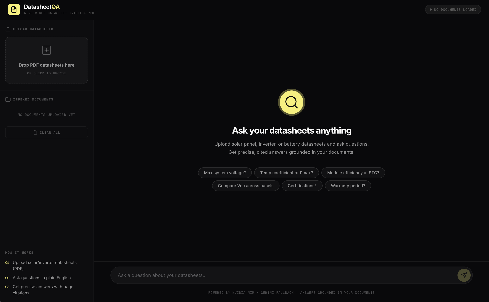
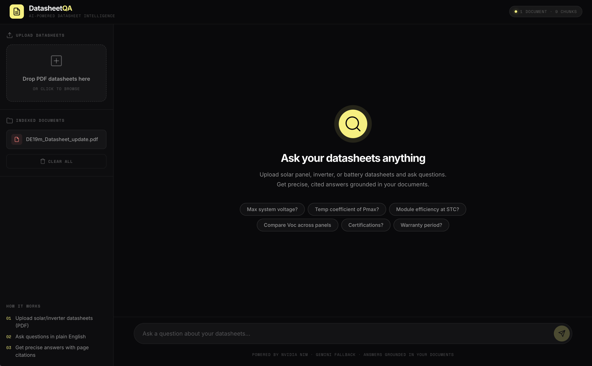
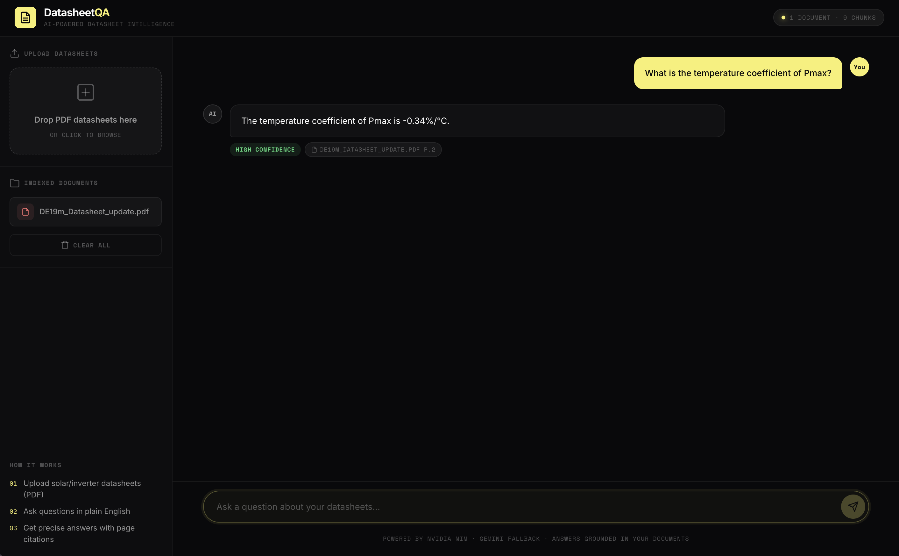
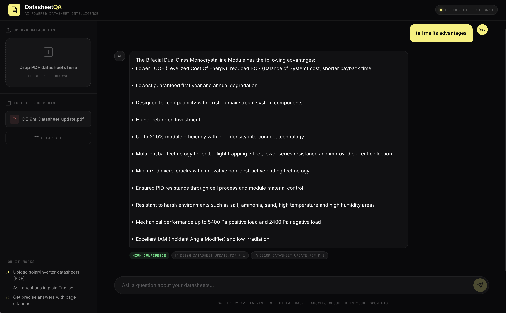

# Results – DatasheetQA

## Setup
- LLM: meta/llama-4-scout-17b-16e-instruct (NVIDIA NIM), Gemini fallback
- Embeddings: nvidia/nemotron-3-embed-1b
- Vector store: FAISS, chunk size 800, top-k 5, similarity threshold 0.35
- Test document: `DE19m_Datasheet_update.pdf` (1 document, 9 chunks indexed)

## Sample Queries

| # | Question | Answer (summary) | Confidence shown | Citation |
|---|----------|------------------|------------------|----------|
| 1 | What is the temperature coefficient of Pmax? | -0.34 %/°C | High | DE19m_Datasheet_update.pdf, p.2 |
| 2 | Tell me its advantages | Bifacial Dual Glass Monocrystalline Module: lower LCOE and BOS cost, up to 21.0% module efficiency, multi-busbar technology, minimized micro-cracks, PID resistance, resistance to harsh environments (salt, ammonia, sand, humidity), mechanical load up to 5400 Pa (positive) / 2400 Pa (negative) | High | DE19m_Datasheet_update.pdf, p.1 (two citations) |

## Observations
- Each answer carries a confidence label and page-level citations.
- Query 2 used the pronoun "its"; the app resolved it to the single indexed datasheet.
- The "Clear All" button resets the index (see the initial state screenshot).
- Testing so far covers one datasheet; more documents and a labeled question set would be needed to measure accuracy.

## Screenshots

**Initial state (no documents loaded)**

**Document uploaded and indexed (1 document, 9 chunks)**

**Query 1: temperature coefficient of Pmax**

**Query 2: advantages of the module**

